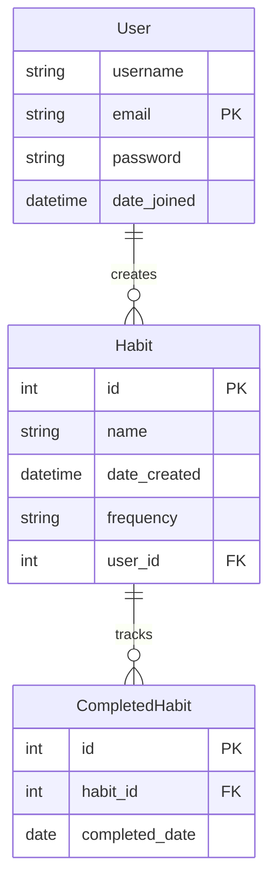

# Habit Tracker

A Django web application for tracking daily, weekly, or monthly habits. Built as part of my learning journey in an effort to further understand full stack web development.

## Database Schema

The habit tracker uses three interconnected models to manage user data and track habits:

### User
Extends Django's AbstractUser model for authentication. Each user can create multiple habits.

### Habit
Represents a habit to track. Contains the habit's name, frequency (daily/weekly/monthly), and links to its creator (User).

### CompletedHabit
Records each habit completion with a timestamp, enabling tracking of consistency and progress over time.
This simple structure provides the foundation for tracking habits and analyzing user progress through data visualization.

## Authentication
Built with Django's authentication framework, enhanced with some custom features:
- Login via username or email
- Secure password requirements (min 9 chars)
- Extended User model for future features
- Session-based auth with CSRF protection
- POST-based logout with confirmation

### Routes
```python
urlpatterns = [
    path('registration/login', views.login, name="login"),
    path('registration/signup', views.signup, name="signup"),
    path('registration/success', views.success, name="success")
]
```

## Setup Instructions
1. Clone the repository
2. Create a virtual environment
3. Install necessary dependencies
4. Set up environment variables
5. Run migrations
6. Start the development server

## Features
- User authentication
- Habit tracking
- Data visualization

## Technologies
- Python
- Django
- SQLite3
