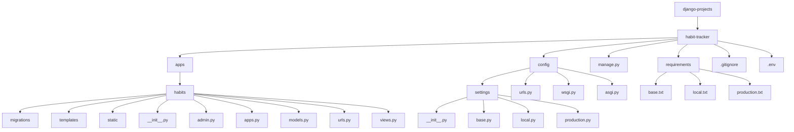

# Habit Tracker

A Django web application for tracking daily, weekly, or monthly habits. Built as part of my learning journey in an effort to further understand full stack web development.

## Project Structure

## Setup Instructions
1. Clone the repository
2. Create a virtual environment
3. Install necessary dependencies
4. Set up environment variables
5. Run migrations
6. Start the development server

## Features
- User authentication
- Habit tracking
- Data visualization

## Technologies
- Python
- Django
- SQLite3
